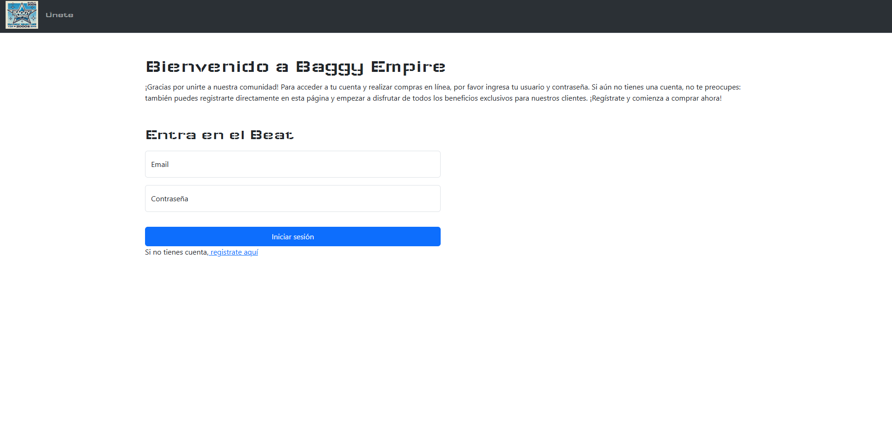
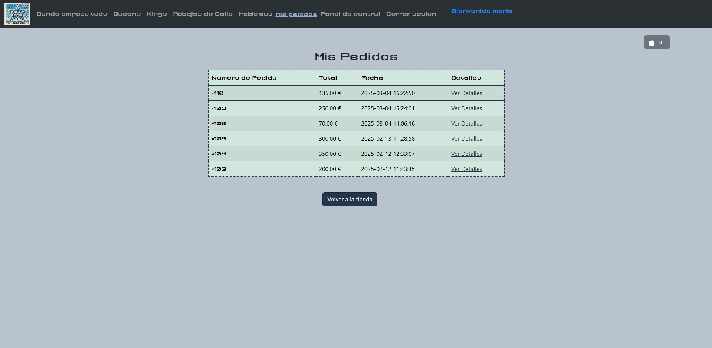
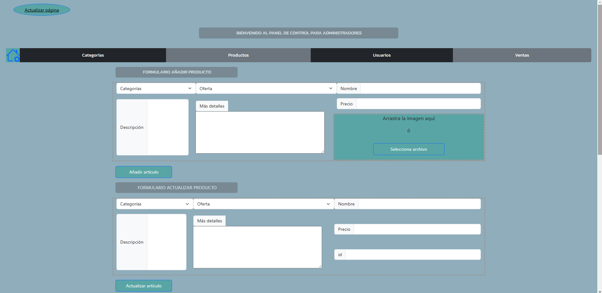

# TIENDA FICTICIA
## Este proyecto es completamente ficticio, sin fines comerciales. Las imágenes de los productos han sido utilizadas solo con fines demostrativos y pertenecen a sus respectivos propietarios.

**Tecnologías utilizadas**
`[HTML], [CSS], [JavaScript], [PHP], [MySQL], [Bootstrap]`
## Funcionalidades
 - Inicio de sesión y registro de usuario.
 - Control de login.
 - Acceso a categorías mediante inicio de sesión.
 - Diferentes categorías con varias productos en cada una de ellas.
 - Botón más detalles, donde veremos un carrusel con más imágenes del producto y una descripción larga.
 - Productos random al final de cada categoría, que invitan al cliente a ver mas productos.
 - Cestita de compra, a la que podremos ir añadiendo productos e ir revisando sin abandonar la página de la categoría en la que estemos.
 - Botón ir a la cesta, en la cúal podemos ver más detalle de nuestro futuro pedido y además ver nuestro historial de pedidos.
 - Realizar la compra obteniendo nuestro ticket correspondiente.
   ### Panel de control para administradores, donde podrán:
  - Añadir, actualizar o eliminar:
     - Usuarios
    - Productos
    - Categorías
    - Ventas
      
*Este proyecto ha sido realizado con mucho cariño y esfuerzo por una desarrolladora junior. En él he querido demostrar las tecnologías en las que me encuentro en pleno crecimiento.*
> Cualquier cosa que creas que se puede mejorar, no dudes en crear un issue. Estaré encantada de aprender algo nuevo y recibir tus sugerencias.

---

## Imágenes

**Inicio de sesión**

**Registro de usuario**

**Página principal**

**Categorías(mujer) y productos random**

**Más detalles**

**Añadir a la cesta**

**Ir a la cesta**

**Finalizar compra**

**Mis pedidos**

### Panel de control para admin

**Inicio**

**categorías**

**Productos**

**Usuarios**

**Ventas**

